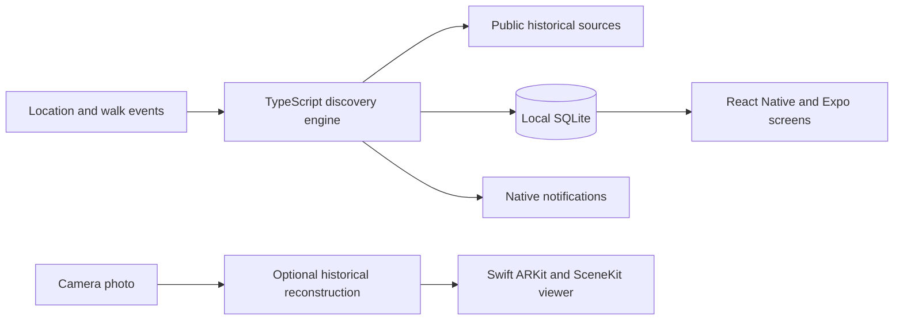

# TripBack: location-based history and AR

A team-built iOS prototype from SYNCS Hack 2026. TripBack turns a walk through Sydney into historical discoveries using location, notifications, local storage, generated scenes, and native AR placement.

This is Santiago Gonzalez Alvarez's portfolio fork of [the team repository](https://github.com/aetherspec/SYNCS-Hack-2026). The upstream authorship and history are preserved.

## My contribution and the branch boundary

My local work focused on Time Windows: a George Street historical scene, a three-stop AR trail, native viewer integration, and improvements after end-to-end QA. Local commits `9137405`, `fdb2ee5`, and `d8dbcd9` record that work.

Those commits are not on the upstream public default branch copied into this fork. The code shown here is the team's public baseline. It should not imply that I authored every feature or that my separate AR branch was merged. A curated source addition requires reviewing the branch and media provenance first.

## Team application architecture



The team app combines React Native, Expo, TypeScript, Swift, ARKit/SceneKit, SQLite, and location notifications. The current application is in `tripback/`.

## Inspect and run

See [the developer runbook](tripback/README.md) for setup and the team's device-testing record. Native AR needs an appropriate physical iPhone and Xcode tooling.

```bash
git clone https://github.com/sgon0181/SYNCS-Hack-2026.git
cd SYNCS-Hack-2026/tripback
npm ci
npm run typecheck
npm test
```

## Evaluation boundaries

Generated historical images are reconstructions, not archival evidence. Cultural-history content requires appropriate consultation before broader use. Client-side model requests should move behind an authenticated backend before wider distribution; no provider key should be committed or shipped in a public app.

Gitleaks found no secrets in the scanned upstream history. This review does not claim a new physical-device or live-provider test. The existing runbook distinguishes compiled native code from outstanding camera-placement checks.

This is a team prototype, not a production release. Code and media retain their original authorship and terms. No repository-wide license was found; this fork grants no rights on behalf of the team or media owners.
